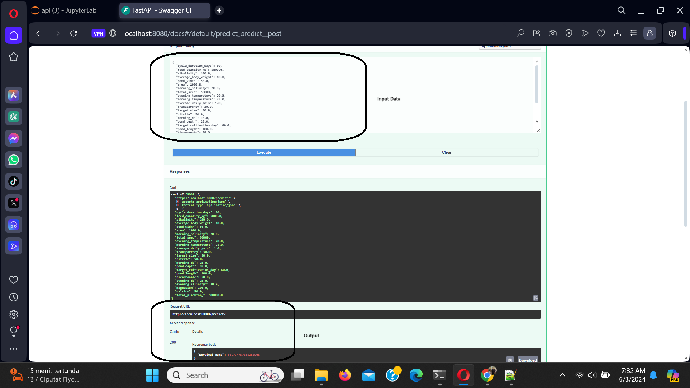
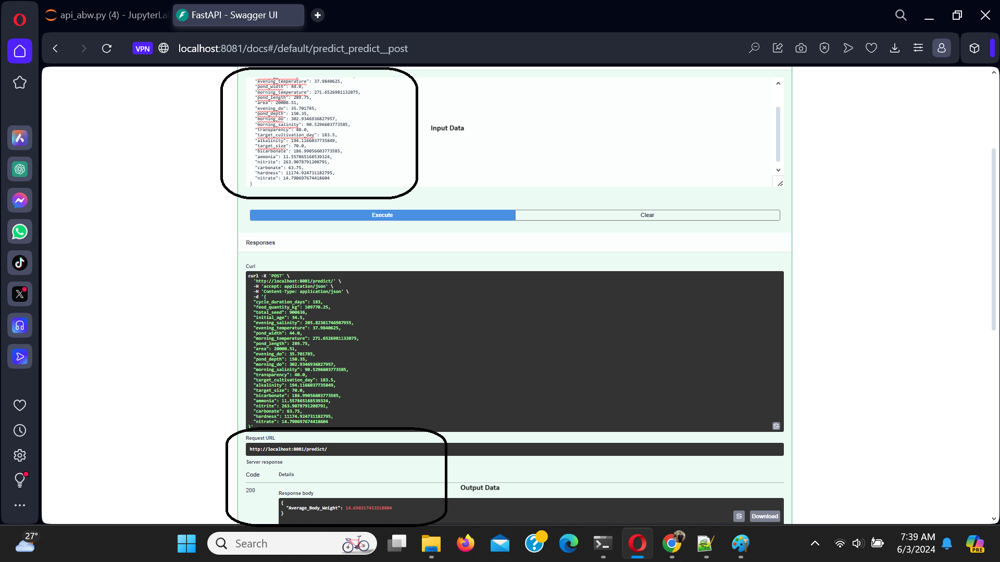
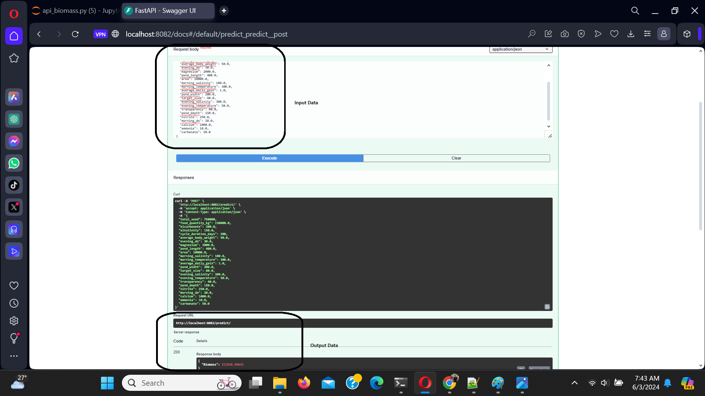
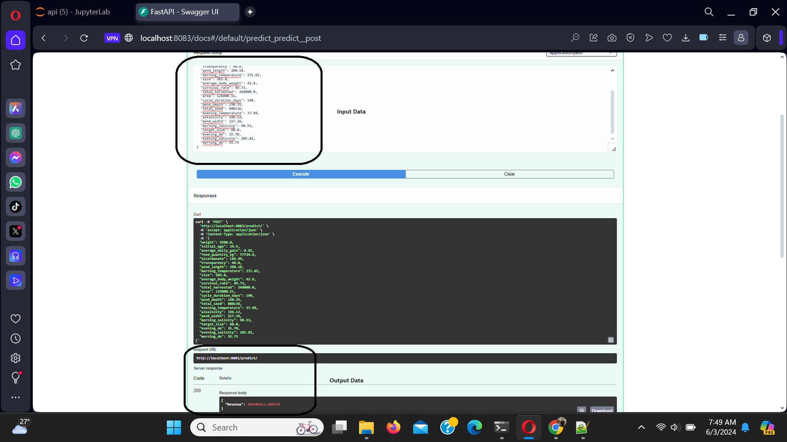

# Predictive Analytics in Shrimp Farming: A Machine Learning Approach

## How to Run the API Service

### Initial Configuration
- Create a folder to clone the files available on this GitHub repository.
- Clone this GitHub repository via the terminal:
  - Open the terminal and navigate to the folder where you want to store the cloned files.
  - Type: `git clone <repository link>`.
- Install a virtual environment:
  - Example: In the same folder as the clone, type in the terminal: `python -m venv env`.
- Activate the virtual environment:
  - Example: `.\env\Scripts\activate` (Windows) or `source env/bin/activate` (Mac/Linux).
- Install the dependencies from `requirements.txt`:
  - Type: `pip install -r requirements.txt`.

The files are now configured. Continue with the steps below according to your needs.

### How to Run the API

- Make sure you are in the main program folder.
- Type: `python api/api_survival_rate.py` to run the API for Survival Rate Prediction.
- Access the API documentation at: `http://127.0.0.1:8080/docs` or `http://localhost:8080/docs`.

To run other API services such as:

- `python api/api_abw` - Service to predict Average Body Weight.
- `python api/api_biomass` - Service to predict Biomass.
- `python api/api_revenue` - Service to predict Revenue.

Follow the same steps as above, but in a different terminal, and use the respective ports:

- `api_abw` - Service to predict Average Body Weight: `http://127.0.0.1:8081/docs` or `http://localhost:8081/docs`.
- `api_biomass` - Service to predict Biomass: `http://127.0.0.1:8082/docs` or `http://localhost:8082/docs`.
- `api_revenue` - Service to predict Revenue: `http://127.0.0.1:8083/docs` or `http://localhost:8083/docs`.

Example : 

- `api_survival_rate` - Service to predict Survival Rate.

- `api_abw` - Service to predict Average Body Weight.

- `api_biomass` - Service to predict Biomass.

- `api_revenue` - Service to predict Revenue.

  